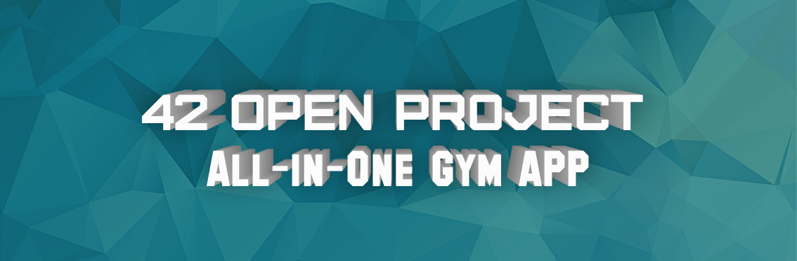

  

# 42 Open Project
[@jkauker](https://profile.intra.42.fr/users/jkauker) [@lbohm](https://profile.intra.42.fr/users/lbohm) [@lglauch](https://profile.intra.42.fr/users/lglauch)

## What we are trying to build
We are trying to build the (in our minds) ultimate Gym App

## What Features do we want?
- Gym Session Tracking
- Training Sessions show up like GitHub commit Calendar
- Motivational Quotes as Pop-Up from time to time
- Track Calories
- See General and per Exercise Progress in a beautiful graph so see Progress
- Friends and Friends Stats
- Visualisation of what body parts are the most and least trained
- All Exercises with a Tutorial Video / Description etc.
- Training Plan and Exercise recommendations
- Cool and Modern Design with useful Widgets

